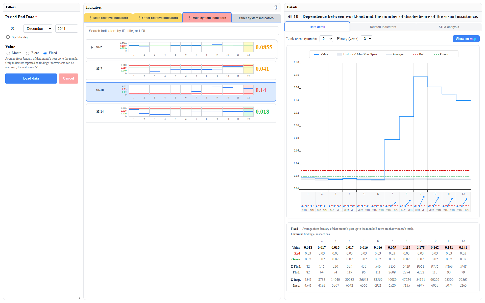
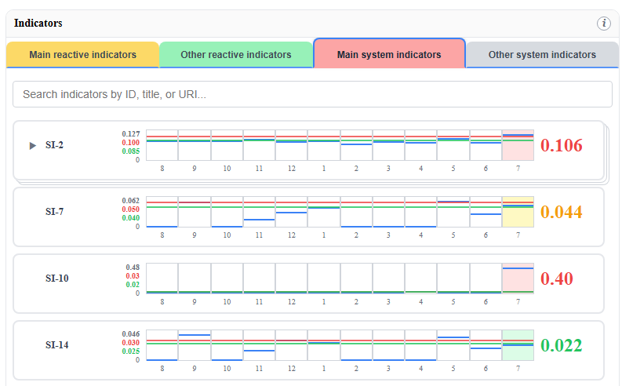
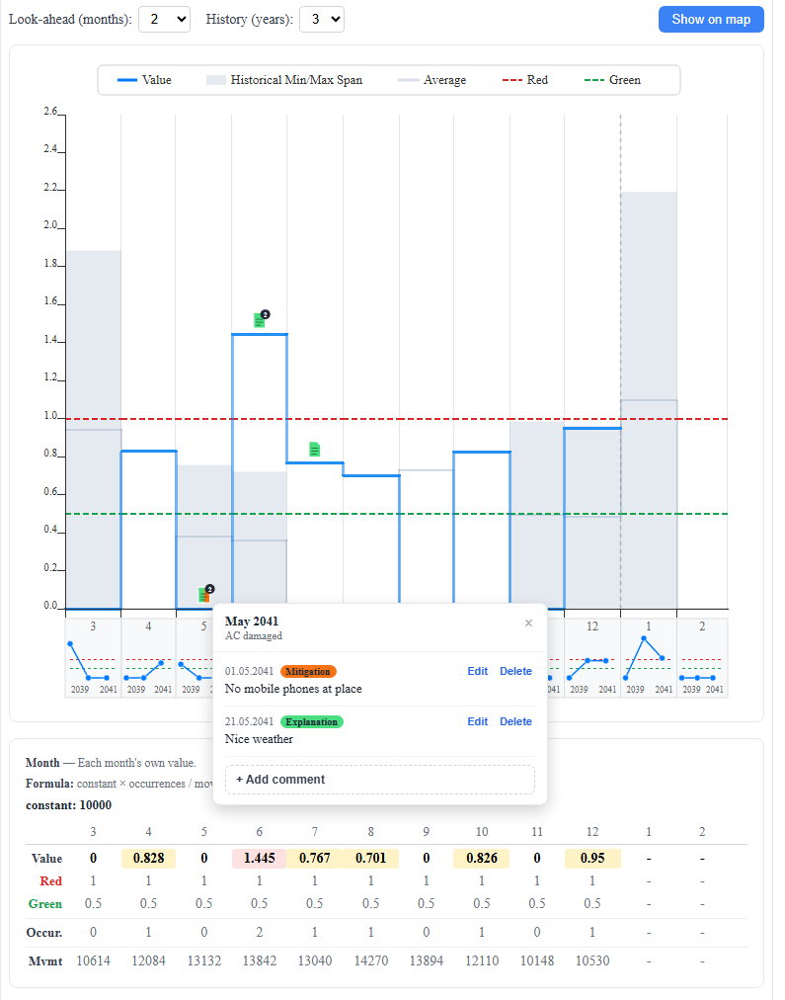
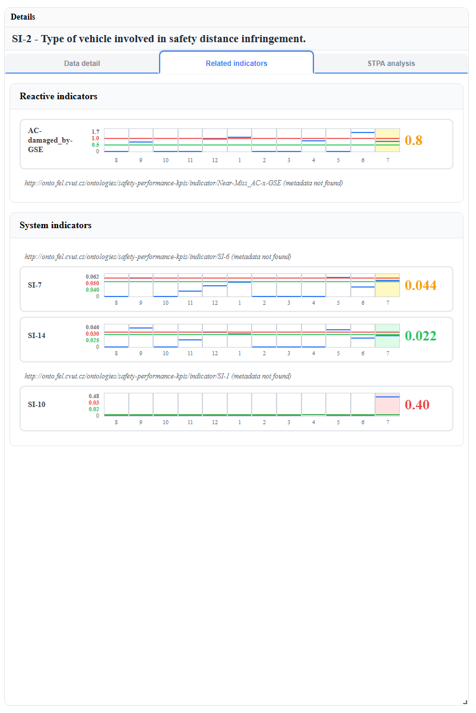

# Safety Viz

Frontend application for measuring and visualizing safety performance of an aviation organization. One of the main outputs of project **CL01000136** (DOPRAVA 2030 programme).



## About

Safety Viz has two main components:

- **Safety indicator overview** — a dashboard of safety performance indicators (SPIs), each rendered as a 12-month line chart with red/green thresholds and a status-colored current value. A detail view adds a step chart with per-month year-over-year sub-graphs, historical min/max bands, comments, related (reactive/system) indicators, and the indicator's STPA analysis (control-structure diagram with status-highlighted interactions, assumptions, system-level requirements).
- **Time-spatial data visualization** — a map + timeline viewer for inspection data (Leaflet map with per-type coloring, heatmap mode, filters; day chart; data table).

| Indicator list | Chart detail with comments | Related indicators |
|---|---|---|
|  |  |  | 

## Architecture

Safety Viz is a single-page application (Vite + React 18 + TypeScript) that talks over REST to a separate backend — the **CL01000136-V2 "Knowledge base"** for storing safety performance knowledge. **The app does not work standalone**: a running backend instance is required, and its base URL is supplied via configuration (below).

One endpoint is currently mocked in the frontend: the indicator schema catalog is served as a static file (`public/mock-data/indicator-schemas.json`, consumed by `src/features/inspectedConditions/api/schemas.ts`) because the backend does not provide that endpoint yet.

State is managed with Zustand; charts are built with visx/d3; maps with Leaflet/react-leaflet; the dashboard layout with react-grid-layout.

## Requirements

- Node.js 22+
- npm
- A running CL01000136-V2 backend instance

## Development

```bash
npm install
cp .env.example .env   # then set SAFETY_VIZ_API_URL to your backend
npm run dev
```

| Script | Purpose |
|---|---|
| `npm run dev` | Vite dev server |
| `npm run build` | Typecheck (`tsc -b`) + production build |
| `npm run lint` | ESLint |
| `npm run preview` | Serve the built `dist/` |
| `npm run verify:calc` | Verify the indicator value-mode calculations (the project's test substitute) |

## Configuration

Configuration is layered — **build-time** (Vite env vars) with **runtime** (`public/config.js`) overriding it. The merge happens in `src/config/envMerge.ts`; the app throws at startup if `API_URL` is missing from both layers.

| Variable | Where | Required | Default | Notes |
|---|---|---|---|---|
| `SAFETY_VIZ_API_URL` | build-time (`.env`) | yes (dev) | — | Backend base URL; a trailing `/` is appended automatically |
| `SAFETY_VIZ_BASENAME` | build-time (`.env`) | no | `""` | Router base path when served from a sub-path |
| `API_URL` | runtime (Docker env / `public/config.js`) | yes (Docker) | — | Overrides the build-time value |
| `BASENAME` | runtime (Docker env / `public/config.js`) | no | `""` | Overrides the build-time value |

Runtime configuration is a plain script loaded before the app:

```js
// public/config.js
window.__config__ = {
  API_URL: "https://backend.example.org/services/safety-performance-server",
  BASENAME: "",
};
```

## Deployment

This repository is deployed from source via CI: GitHub Actions builds the app and publishes a Docker image ([package](https://github.com/cmolik/safety_viz/pkgs/container/safety_viz)) to the GitHub Container Registry, which the hosting infrastructure then pulls and runs. No local build step is part of the deployment path.

## Libraries

* [React](https://react.dev/)
* [TypeScript](https://www.typescriptlang.org/)
* [React Router](https://reactrouter.com/)
* [Zustand](https://zustand.docs.pmnd.rs/)
* [D3](https://d3js.org/)
* [Leaflet](https://leafletjs.com/)
* [React Leaflet](https://react-leaflet.js.org/)
* [visx](https://airbnb.io/visx/)
* [React Grid Layout](https://github.com/react-grid-layout/react-grid-layout)
* [react-resizable](https://github.com/react-grid-layout/react-resizable)

## License

This project is licensed under the [GNU General Public License v3.0](LICENSE) (GPL-3.0). You may use, modify, and redistribute it under the same license; derivative works must remain open source and retain the original copyright notices.

## Acknowledgments

This software is an output of project **CL01000136**, supported by the Technology Agency of the Czech Republic within the DOPRAVA 2030 programme.

Developed at the Faculty of Electrical Engineering, Czech Technical University in Prague.
